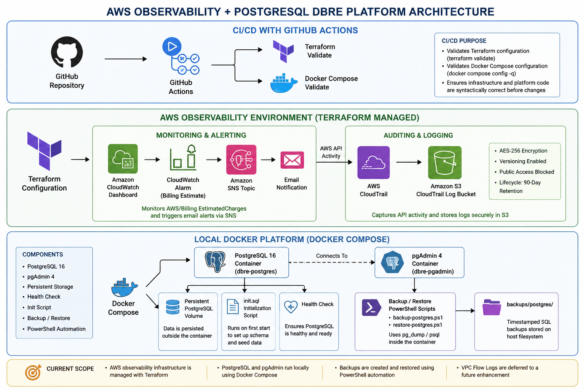

# AWS Observability + PostgreSQL DBRE Platform

A production-inspired portfolio project demonstrating AWS observability, Infrastructure as Code (IaC), containerized PostgreSQL administration, CI validation, backup and recovery, and operational reliability practices.

The project combines a Terraform-managed AWS observability environment with a local Docker Compose PostgreSQL platform to demonstrate practical Cloud Engineering, Database Reliability Engineering (DBRE), and Site Reliability Engineering (SRE) workflows.

---

## Project Overview

This project was built to demonstrate operational ownership across infrastructure, monitoring, database administration, automation, incident response, and recovery.

The environment consists of two primary platforms:

- **AWS Observability Environment** — Terraform-managed CloudWatch, SNS, CloudTrail, and secured S3 log storage.
- **Local Database Platform** — PostgreSQL 16 and pgAdmin 4 deployed through Docker Compose with persistent storage, initialization automation, health checking, and PowerShell-based backup and restore tooling.

GitHub Actions provides automated validation of the Terraform and Docker Compose configurations.

> **Current Scope:** PostgreSQL and pgAdmin run locally through Docker Compose. AWS hosts the observability and auditing infrastructure. PostgreSQL is not deployed to AWS in the current version. GitHub Actions performs configuration validation; Terraform deployment remains operator-controlled.

---

## Architecture



The architecture consists of three operational layers:

### AWS Observability

- Amazon CloudWatch dashboard
- CloudWatch EstimatedCharges alarm
- Amazon SNS email alerting
- AWS CloudTrail API auditing
- Secure Amazon S3 CloudTrail log storage
- Terraform-managed infrastructure
- Standardized infrastructure tagging

### Local PostgreSQL Platform

- PostgreSQL 16
- pgAdmin 4
- Docker Compose
- Persistent Docker volumes
- PostgreSQL initialization script
- Container health checking
- PowerShell backup and restore automation

### CI Validation

- GitHub Actions
- Terraform formatting validation
- Terraform configuration validation
- Docker Compose configuration validation
- Push and pull-request validation

---

## AWS Monitoring and Observability

Terraform provisions the AWS observability environment.

### CloudWatch Dashboard

The project creates a CloudWatch dashboard containing an AWS billing metric widget for operational visibility.

### CloudWatch Alarm

A CloudWatch alarm monitors:

- Namespace: `AWS/Billing`
- Metric: `EstimatedCharges`
- Currency: `USD`
- Statistic: `Maximum`

The alarm integrates with Amazon SNS for email notification.

The billing alarm is intentionally used as a low-cost test signal for demonstrating the complete monitoring and alerting workflow.

### CloudTrail Auditing

AWS CloudTrail provides API activity auditing and delivers trail logs to a dedicated S3 bucket.

The S3 logging architecture includes:

- AES-256 server-side encryption
- S3 versioning
- Public access blocking
- 90-day current-object retention
- 30-day noncurrent-version expiration
- 7-day cleanup of incomplete multipart uploads

This provides a controlled logging-retention strategy while limiting unnecessary long-term storage in the portfolio environment.

---

## PostgreSQL Platform

The local database platform is deployed using Docker Compose.

### Components

- PostgreSQL 16 container
- pgAdmin 4 administration interface
- Persistent PostgreSQL storage
- Persistent pgAdmin storage
- PostgreSQL health check
- Automated database initialization
- Host-based backup storage

The PostgreSQL initialization script creates the application schema and health-check objects used for database validation.

Operational validation includes:

- PostgreSQL version verification
- Database connectivity validation
- Application health-check queries
- Session/activity inspection
- Container health monitoring
- PostgreSQL log inspection

---

## Backup and Recovery

PowerShell scripts automate logical PostgreSQL backup and restore operations:

```text
scripts/
├── backup-postgres.ps1
└── restore-postgres.ps1
```

Backups use PostgreSQL `pg_dump` inside the database container and are copied to timestamped SQL files on the host.

Restore operations use `psql` to load the logical backup into PostgreSQL.

A controlled recovery test was performed by:

1. Creating and validating application data.
2. Generating a logical database backup.
3. Simulating data loss.
4. Restoring from the backup.
5. Verifying successful recovery of the application data.

This validates the recovery workflow rather than relying only on successful backup creation.

> The current implementation uses logical SQL backups for portfolio and lab recovery testing. It does not implement production features such as point-in-time recovery or managed remote backup storage.

---

## CI Validation with GitHub Actions

The repository contains two GitHub Actions workflows:

```text
.github/workflows/
├── terraform-validate.yml
└── docker-validate.yml
```

### Terraform Validation

The Terraform workflow performs:

- `terraform fmt -check -recursive`
- `terraform init`
- `terraform validate`

### Docker Compose Validation

The Docker workflow validates the Docker Compose configuration before changes are merged or published.

The workflows run on relevant repository updates and pull requests.

> The current CI implementation validates infrastructure and platform configuration. It does not automatically execute `terraform apply` or deploy AWS infrastructure.

---

## Operational Engineering

The project includes operational procedures covering:

- Infrastructure validation
- Database health verification
- Container troubleshooting
- PostgreSQL log analysis
- Incident investigation
- Service recovery
- Backup verification
- Database restoration
- AWS monitoring validation
- CloudTrail auditing
- CI troubleshooting

The operational workflow follows an evidence-driven process:

**Detect → Validate → Assess → Investigate → Recover → Validate → Document**

---

## Documentation

Detailed project documentation is available in:

- [Architecture](docs/architecture.md)
- [Deployment Guide](docs/deployment-guide.md)
- [Troubleshooting Guide](docs/troubleshooting-guide.md)

Operational runbooks:

- [Incident Response Runbook](runbooks/incident-response-runbook.md)
- [PostgreSQL Backup and Restore Runbook](runbooks/postgres-backup-restore-runbook.md)

---

## Project Evidence

The repository includes implementation evidence captured during deployment, validation, monitoring, and database operations.

### AWS Observability

- [CloudWatch Dashboard](screenshots/cloudwatch-dashboard.png)
- [CloudWatch Alarm](screenshots/cloudwatch-alarm.png)
- [CloudTrail](screenshots/cloudtrail.png)

### CI Validation

- [GitHub Actions](screenshots/github-actions.png)

### PostgreSQL and Docker

- [Docker Containers](screenshots/docker-containers.png)
- [pgAdmin PostgreSQL Validation](screenshots/pgadmin-postgres.png)
- [PostgreSQL Command-Line Validation](screenshots/postgres-validation.png)

### Backup and Recovery

- [Backup Automation Evidence](screenshots/backup-restore.png)

---

## Repository Structure

```text
.
├── .github/
│   └── workflows/
│       ├── docker-validate.yml
│       └── terraform-validate.yml
├── backups/
│   └── postgres/
├── diagrams/
│   └── aws-observability-postgres-dbre.png
├── docker/
│   ├── .env.example
│   ├── docker-compose.yml
│   └── init.sql
├── docs/
│   ├── architecture.md
│   ├── deployment-guide.md
│   └── troubleshooting-guide.md
├── runbooks/
│   ├── incident-response-runbook.md
│   └── postgres-backup-restore-runbook.md
├── screenshots/
│   ├── backup-restore.png
│   ├── cloudtrail.png
│   ├── cloudwatch-alarm.png
│   ├── cloudwatch-dashboard.png
│   ├── docker-containers.png
│   ├── github-actions.png
│   ├── pgadmin-postgres.png
│   └── postgres-validation.png
├── scripts/
│   ├── backup-postgres.ps1
│   └── restore-postgres.ps1
├── terraform/
│   ├── data.tf
│   ├── main.tf
│   ├── outputs.tf
│   ├── providers.tf
│   ├── terraform.tfvars.example
│   ├── variables.tf
│   └── versions.tf
├── .gitignore
└── README.md
```

Local Terraform state, populated variable files, database dumps, and other runtime artifacts are excluded from version control.

---

## Security Controls

The project incorporates several infrastructure and repository security practices:

- S3 public access blocking
- S3 server-side encryption
- CloudTrail API auditing
- Controlled S3 log retention
- Terraform-managed infrastructure
- Standardized AWS resource tagging
- Local sensitive/runtime files excluded through `.gitignore`
- Terraform state excluded from version control
- Populated `terraform.tfvars` excluded from version control
- Database backup files excluded from version control
- Example configuration files separated from local runtime configuration

No production credentials should be stored in the repository.

---

## Key Skills Demonstrated

### Cloud Engineering

- AWS monitoring and observability
- Infrastructure as Code with Terraform
- Cloud resource tagging
- Infrastructure lifecycle management
- Logging and auditing
- Alerting workflows

### Database Reliability Engineering

- PostgreSQL administration
- Database health validation
- Logical backup and restore
- Recovery testing
- Database troubleshooting
- Service restoration

### Site Reliability Engineering

- Health checks
- Incident investigation
- Log analysis
- Monitoring and alerting
- Recovery validation
- Operational runbooks

### Platform Engineering

- Docker Compose
- Containerized database services
- Persistent storage
- Infrastructure automation
- CI configuration validation
- Git-based infrastructure workflows

---

## Lessons Learned

- Infrastructure should be managed as code wherever practical.
- Monitoring provides the most operational value when paired with actionable alerting.
- Successful backup creation alone does not prove recoverability; backups must be tested through restoration.
- Operational documentation and runbooks reduce ambiguity during incident response.
- CI validation improves consistency and catches configuration errors before infrastructure or platform changes are executed.
- Logging requires an explicit retention strategy to balance operational value, security, and cost.
- Repository documentation should be validated in the rendered environment in which it will be consumed, including GitHub Markdown rendering.
- Portfolio infrastructure should be designed for repeatable deployment and destruction to control cloud cost.

---

## Current Scope and Limitations

This project is intentionally scoped as a portfolio and lab environment.

Current limitations include:

- PostgreSQL runs locally rather than on AWS.
- VPC Flow Logs are deferred.
- GitHub Actions validates configuration but does not perform Terraform deployment.
- PostgreSQL metrics are not currently exported to CloudWatch, Prometheus, or Grafana.
- Backup execution is operator initiated.
- Logical backups do not provide point-in-time recovery.
- The project does not represent a production PostgreSQL deployment.

These limitations define natural areas for future expansion without overstating the capabilities of the current implementation.

---

## Future Enhancements

Potential Version 2 enhancements include:

- VPC Flow Logs
- CloudWatch Logs integration and retention policies
- PostgreSQL metrics exporter
- Prometheus integration
- Grafana dashboards
- Automated backup scheduling
- Automated restore validation
- Remote backup storage
- Terraform plan workflow
- Controlled Terraform deployment workflow
- Remote Terraform state
- Multi-environment Terraform deployments
- PostgreSQL metrics integration with AWS observability
- ECS-based PostgreSQL deployment

---

## Author

Built as a Cloud Engineering and Database Reliability Engineering portfolio project focused on observability, infrastructure automation, database operations, recovery, incident response, and platform reliability.